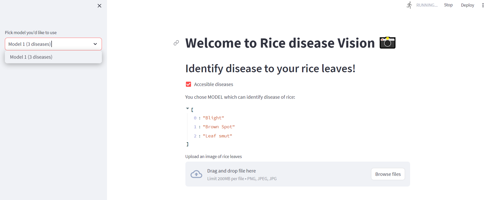
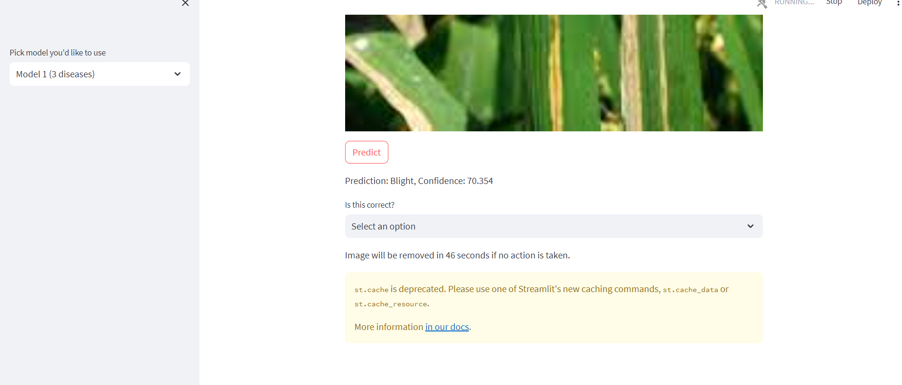

# Disease Prediction of Agriculture Plants
Disease prediction in farming is of utmost importance for several reasons, as it can have significant impacts on agricultural productivity, food security, and the economy. Here are some key reasons highlighting the importance of disease prediction in farming:

* Crop Protection
* Reduced Chemical Usage:
* Cost Saving 
* promoting practices that minimize environmental impacts, conserve resources, and promote long-term food security.
* Food Security
* Precision Agriculture 
* Risk Management 
* Environmental Conservation  
* Research and Innovation  
* Data-Driven Agriculture

# Rice Plant Disease Prediction


## Download Repository

```
git clone --depth 1 https://github.com/ShreyashChacharkar/Agriculture_data.git
```

## Change directory

```
cd agri-app
```

## Create virtual environment

```
python -m venv .venv
```

* For windows
```
.venv/Scripts/activate 
```

* For linux
```
source .venv/bin/activate
```

## Install requirements

```
pip install -r requirements.txt
```

## Train

```
run streamlit app.py

```


check avilable model by clicking at model and diseases by accesible diseases

Give feedback whther image is correct or not

link to the agricultural dataset
1. https://www.kaggle.com/datasets/nafishamoin/new-bangladeshi-crop-disease/code
2. https://www.kaggle.com/datasets/thammuio/all-agriculture-related-datasets-for-india
3. https://www.kaggle.com/datasets/mamtag/tomato-village
4. https://www.kaggle.com/datasets/mohitsingh1804/plantvillage
5. https://www.kaggle.com/datasets/thedevastator/statewise-crop-production-in-india-a-statistical
6. https://www.kaggle.com/datasets/herbwood27/crop-disease-dataset
7. https://www.kaggle.com/code/huberthamelin/leaf-diseases-detection
8. https://www.kaggle.com/datasets/nizorogbezuode/rice-leaf-images/code
9. https://www.kaggle.com/datasets/vbookshelf/rice-leaf-diseases
10. https://www.kaggle.com/datasets/nafishamoin/bangladeshi-crops-disease-dataset
